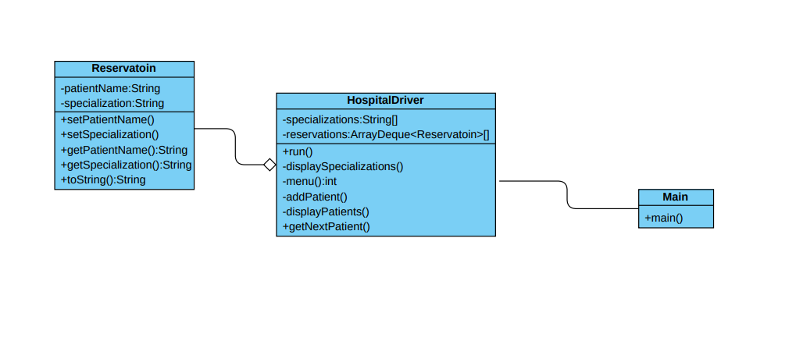

# Description

- This projects is implementation of these [Requirements](./doc/01%20Project%20%231.pdf)
  it contains four main options:
  - Add new patient.
  - Print All patients.
  - Get Next patient.
  - Exit.

so in this System we have three class as show in [UML Digram](./doc/UML.pdf)

- ***[Reservation class](./HospitalSystem/src/hospitalsystem/Reservatoin.java)***
- ***[HospitalDriver class](./HospitalSystem/src/hospitalsystem/HospitalDriver.java)***
- ***[Main class](./HospitalSystem/src/Main.java)***
